<!-- Generated by GitHub Profile Agent Console. Edit profile.config.json, then run npm run generate. -->

  <picture>
    <source media="(max-width: 760px) and (prefers-color-scheme: dark)" srcset="./assets/hero/agent-console-54730d1d-mobile-dark.svg">
    <source media="(max-width: 760px)" srcset="./assets/hero/agent-console-54730d1d-mobile-light.svg">
    <source media="(prefers-color-scheme: dark)" srcset="./assets/hero/agent-console-54730d1d-dark.svg">
    <source media="(prefers-color-scheme: light)" srcset="./assets/hero/agent-console-54730d1d-light.svg">
    
  </picture>

  

## About Me

I build intelligent systems that turn research, data, and emerging technologies into practical solutions for real-world problems.

My work is driven by curiosity and execution: exploring ideas, building intelligent systems, testing them rigorously, and turning promising concepts into real-world solutions.

## Current Focus

| Area | What I am exploring |
| --- | --- |
| **Big Data** | Large-scale data processing, analytics, and intelligent pipelines for extracting reliable insights from complex, high-volume data. |
| **Applied AI** | Practical AI solutions that transform data and models into reliable, usable systems for real-world problems. |
| **Vibe Coding** | AI-assisted software development focused on rapid prototyping, iterative building, and turning ideas into working products. |
| **Multimodal** | Integration and reasoning across text, audio, images, and sensor data to build richer and more context-aware AI systems. |

## Featured Work

| Project | Focus | Why it matters |
| --- | --- | --- |
| [**Fuel Intelligence**](https://github.com/hibscolony/fuel_intelligence_2) | Monitoring fuel consumption | A data-driven dashboard for monitoring fuel consumption, analyzing usage patterns, and supporting more efficient operational decisions through clear and actionable insights. |

## Research Direction

I am interested in building intelligent systems that can understand complex data, reason across multiple modalities, evaluate their outputs, and support real-world decisions while remaining transparent, reliable, and under meaningful human oversight.

## Tech Stack

`Python` · `PyTorch` · `Next.js` · `PostgreSQL` · `Git`

## Recent Activity

<!-- AUTO:ACTIVITY:START -->
- Aug 18, 2026: created a branch in [hibscolony/fuel_intelligence_2](https://github.com/hibscolony/fuel_intelligence_2).
- Aug 13, 2026: pushed 1 commit to [hibscolony/competitive-speech-writer](https://github.com/hibscolony/competitive-speech-writer).
- Aug 13, 2026: pushed 1 commit to [hibscolony/hibscolony](https://github.com/hibscolony/hibscolony).
- Aug 13, 2026: created a branch in [hibscolony/hibscolony](https://github.com/hibscolony/hibscolony).
- Aug 12, 2026: created a branch in [hibscolony/GitHibs](https://github.com/hibscolony/GitHibs).
- Aug 12, 2026: pushed 1 commit to [hibscolony/competitive-speech-writer](https://github.com/hibscolony/competitive-speech-writer).
<!-- AUTO:ACTIVITY:END -->

---

  Building intelligent systems and sharing what works.

